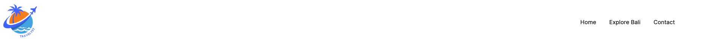

# travelyet.com

The concept underlying travelyet is to create a platform that provides a precise overview of the trendiest and other prominent travel destinations. In today's world, individuals seek rapid insights into travel opportunities. The issue that Travelyet.com aims to address is the overwhelming inundation of information pertaining to diverse travel destinations, structured and presented with precision. Through the website, users can educate themselves about the travel destination. Via experience blogs, tips and tricks blogs, or even reviews about the travel destination, users can swiftly and accurately inform themselves. The platform also collaborates with an affiliate program. travelyet offers the opportunity to book travel directly through the partner, Booking.com. Users can book a trip directly after they have educated themselves. The customization of the travel experience is possible.

In the future, Travelyet.com intends to introduce an Ambassador Program, where users can enroll. In this program, users can monetize their experiences and generate income. They can present and monetize their experiences through blogs or vlogs.

In the near future, an e-commerce function is also set to be implemented. In addition to the service, physical products will be offered for sale.

The target audience for travelyet is diverse. Anyone with an interest in travel can use the website. While there is no specific restriction to a single target audience, various audience segments can be identified. The younger generation has different preferences for travel destinations compared to the older generation.

The design strategy is to create a modern and simplistic website, aiming to provide a straightforward and expedient user experience. The website should not appear cluttered, allowing users to navigate quickly and effortlessly.

[View Lunar Escape live project here]()
- - -
## Table of Contents

### [User Experience (UX)](#user-experience-ux-1)
* [User Stories](#user-stories)
### [Features](#features)
* [Existing Features](#existing-features)
### [Features Left to Implement](#features-left-to-implement-1)
### [Design](#design-1)
### [Technologies Used](#technologies-used-1)
### [Frameworks, Libraries & Programs Used](#frameworks-libraries--programs-used-1)
### [Testing](#testing-1)
* [Validation Results](#validation-results)
* [Manual Testing](#manual-testing)
* [Lighthouse Report](#lighthouse-report)
### [Deployment and local development](#deployment-and-local-development-1)
* [GitHub Pages](#github-pages)
* [Forking the GitHub Repository](#forking-the-github-repository)
* [Local Clone](#local-clone)
### [Credits](#credits-1)
### [Acknowledgements](#acknowledgements-1)
---

## User Experience (UX)

Travelyet redefines travel planning with a clear, concise platform, connecting you effortlessly to the world's trendiest destinations. Discover, learn, and book your next adventure through our partnership with Booking.com, all in one streamlined experience. Our future holds exciting opportunities, like the Travelyet Ambassador Program, allowing you to share and monetize your travel stories. As we evolve, look out for our e-commerce feature, enhancing your journey with essential travel products. Designed for ease, our modern, simplistic website caters to every traveler's need, ensuring your journey to discovery is just a few clicks away. Welcome to Travelyet – where every journey starts with clarity and ends with unforgettable experiences.

### User Stories

 * First-time visitor goals
    * Understand the main purpose of the site and learn more about the Lunar Escape company.
    * Easily navigate throughout the site.
    * Find the Offers and informations on the website.
 * Returning visitor goals
    * Find out information about new destination.
    * Find the best way to get in contact with the company with any questions they may have.
    * Finding new offers.

 * Frequent user goals
    * Check if there are any new destination with new offers.
    * Review the comments form the travelyet.com ambassador.
- - -

## Features

* This website is targeting people who want to travel.
* They can do that by navigating to the sign-up page and filling out a form.
* Responsive on all device sizes.

### Existing Features

* Navigation bar
    * It is featured and fixed on all three pages and the form-received page.
    * Includes links to the logo, home page, explore Bali, and contact page.
    * It is identical in design across the pages.
    * Allows easy navigation from page to page without having to revert back to the previous page via the "back" button.

* Main heading
    * It is composed of a background image featuring "stars in the night sky".
    * Main heading, which is unique for each page:
        * The home page is comprised of 'Are you ready to explore the moon?"
        * Gallery is made up of 'Welcome to our Gallery'.
        * The sign up page is comprised of 'Application Form'
        * appllication-received is comprised of 'Application Received'.

* Section one, Dreams and info
    * This section contains a short heading followed by images.
    * It gives us a brief description of what we can accomplish through this website.

* Section two, 'How is it possible?'
    * Information about commercial rocket.
    * Link to the Sign Up form page to apply for a lucky draw.

* About Lunar Escape
    * This section will allow users to get information about the Lunar Escape Company.
    * Opportunity to join the company because they are always looking for talented people.
    * Address and contact number.

* Footer
    * Links to the social media for Lunar Escape will open in a new tab to allow easy navigation for the user.
    * It is valuable to the user as it gives them an easy contact option via social media.
    * Hold copyright information about the author. 

* Gallery 
    * The gallery will provide the user with supporting images to see shuttle launches, flights, and astronauts.
    * This section is valuable to the user as they will see our previous flights and astronauts on the Moon.

* The Sign Up page
    * This page will allow users to choose a package, sign up for it, and win a trip to the moon in a lucky draw.
    * The user can choose a regular flight and explore the surface of both of these to be in the lucky draw.
    * In the future, there might be more packages to choose from. 

* The Sign Up received page
    * Form received

---

## Features Left to Implement

* Additional packages might be available in the form section.
* Updated gallery with additional images.
* In the future, there could be an online academy that will teach aerospace engineering, which you could join through this website.
---

## Design

 * Colour Scheme
    * Primary colors used on the website: 

 * Typography
    * Kanit font is main font used throughout the ite with sans-serif as its fallback font in case Kanit doesn't import for some reasson.

 * Wireframes
    * Pen and paper in a notebook: simple and effective.
---

## Technologies Used

 * [HTML5](https://en.wikipedia.org/wiki/HTML5)
 * [CSS3](https://en.wikipedia.org/wiki/CSS)

---

## Frameworks, Libraries & Programs Used

 * [Gitpod](https://www.gitpod.io/)
    * To write the code.
 * [Git](https://git-scm.com/)
    * for vesion control.
 * [Github](https://github.com/)
    * Deployment of the website and storing the files online.
 * [Google Fonts](https://fonts.google.com/)
    * Import main font the website.
* [Am I Responsive](https://ui.dev/amiresponsive)
    * Mockup picture for the README file.
---

## Testing

The W3C Markup Validator and W3C CSS Validator services were used to validate every page of the project to ensure there were no errors.

 * [W3C Markup Validtor](https://validator.w3.org/)
 * [W3C CSS Validator](https://jigsaw.w3.org/css-validator/)

### Validation results

index.html

gallery.html

sign-up.html

form-received.htmml

style.css

### Manual Testing

* The website was tested on Google Chrome, Microsoft Edge, and Opera browsers.
* The website was viewed on a desktop computer, laptop, and Samsung Galaxy A52 mobile phone.
* A large amount of testing was done to ensure links between pages are working correctly on all pages.
* Family and friends were asked to review the website for a better understanding of the user experience.
* Dev Tools was used to test how the site looks on various screen sizes.

### Lighthouse Report

#### Mobile analysis

Home Page

Gallery

Sign Up

Application Received

#### Desktop analysis

Home Page

Gallery

Sign Up

Application Received

---

## Deployment and local development

### GitHub Pages

GitHub Pages used to deploy live version of the website.
1. Log in to GitHub and locate [GitHub Repository Lunar Escape](https://github.com/Thomas-Tomo/Lunar-Escape)
2. At the top of the Repository(not the main navigation) locate "Settings" button on the menu.
3. Scroll down the Settings page until you locate "GitHub Pages".
4. Under "Source", click the dropdown menu "None" and select "Main" and click "Save".
5. The page will automatically refresh.
6. Scroll back to locate the now-published site [link](https://thomas-tomo.github.io/Lunar-Escape/index.html) in the "GitHub Pages" section.

### Forking the GitHub Repository

By forking the repository, we make a copy of the original repository on our GitHub account to view and change without affecting the original repository by using these steps:

1. Log in to GitHub and locate [GitHub Repository Lunar Escape](https://github.com/Thomas-Tomo/Lunar-Escape)
2. At the top of the Repository(under the main navigation) locate "Fork" button.
3. Now you should have a copy of the original repository in your GitHub account.

### Local Clone

1. Log in to GitHub and locate [GitHub Repository Lunar Escape](https://github.com/Thomas-Tomo/Lunar-Escape)
2. Under the repository name click "Clone or download"
3. Click on the code button, select clone with HTTPS, SSH or GitHub CLI and copy the link shown.
4. Open Git Bash
5. Change the current working directory to the location where you want the cloned directory to be made.
6. Type `git clone` and then paste The URL copied in the step 3.
7. Press Enter and your local clone will be created.

---

## Credits

### Code
 * Understanding the concept of flexbox was learned through [Complete Guide to Flexbox](https://css-tricks.com/snippets/css/a-guide-to-flexbox/)
 * The README template was helpfully provided by [Code Institute (template)](https://github.com/Code-Institute-Solutions/SampleREADME)

### Content

 * All content was written by the developer.
 * [Color contrast checker](https://coolors.co/contrast-checker/112a46-acc8e5) was used to decide which colors would be used for the website.

### Media 

 * [Pexels](https://www.pexels.com/) free stock photos, royalty free images.
 * [Pixabay](https://pixabay.com/) free stock photos, royalty free images.
 * [Pixlr](https://pixlr.com/) Resizing images.
---

## Acknowledgements

 * My mentor Mitko Bachvarov provided helpful feedback and a link to the Flexbox guide.
 * Slack community for encouragement and information.